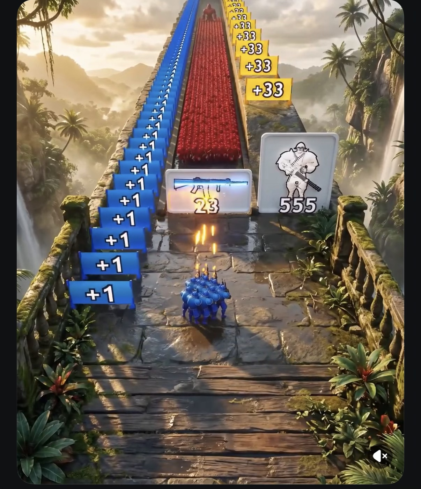

# Runenschacht

Ein 3D-Crowd-Runner-Shooter für Browser und Smartphone (three.js + TypeScript):
Ein blauer Trupp läuft automatisch über eine Dschungel-Hängebrücke, feuert nach vorne,
sammelt `+1`/`+33`-Blöcke, schießt Upgrade-Karten frei, wählt Tore, kämpft sich durch eine
rote Gegnerhorde und besiegt am Ende den Boss.



## Status

Planungsphase. Der vollständige Umsetzungsplan (86 Schritte in 11 Phasen, inklusive
abschließender UI/UX-Überarbeitung) liegt in [`docs/plan/`](docs/plan/README.md).
Arbeitsregeln für das ausführende Modell stehen in [`CLAUDE.md`](CLAUDE.md).

## Entwicklung

```bash
npm install
npm run dev     # Entwicklungsserver
npm run check   # Typecheck, Lint, Format, Tests, Build
```

## Online spielen

Nach jedem Push auf `main` baut `.github/workflows/deploy.yml` das Spiel und veröffentlicht es auf GitHub Pages.
Dazu in den Repository-Einstellungen unter *Pages → Source* **„GitHub Actions“** auswählen.

## Plan

Siehe [`docs/plan/README.md`](docs/plan/README.md).

## Debug-Parameter

URL-Parameter für Entwicklung und Tests:

| Parameter | Wirkung |
|---|---|
| `?level=3` | Level direkt starten |
| `?seed=42` | Seed des Levels überschreiben |
| `?autoplay=1` | Bot steuert den Trupp |
| `?speed=4` | Zeitraffer (1–8) |
| `?debug=1` | FPS-/Zustandsanzeige und `window.__game` |
| `?quality=low\|medium\|high` | Grafikqualität erzwingen |

`window.__game` (nur mit `debug=1` oder im Dev-Server): `getState()`, `start(level)`, `skipTo(z)`, `win()`, `lose()`.
