# UX-Audit

Baseline-Screenshots: `docs/ux/baseline/` (Phone 390×844 und Desktop 1280×800, erzeugt mit `npm run screenshots`).
Nach der Überarbeitung: `docs/ux/after/` (Schritt 10.14).

Schwere: **hoch** = verhindert Verständnis/Bedienung, **mittel** = stört spürbar, **niedrig** = Feinschliff.

| # | Bildschirm | Beobachtung | Problem | Schwere | Behoben in | Status |
|---|---|---|---|---|---|---|
| 1 | Laden | Nur Titel und „Lädt…“ | Kein Fortschritt, wirkt eingefroren | mittel | 10.8 | [x] |
| 2 | Menü | „Spielen – Level 1 · Die Hängebrücke“ bricht auf zwei Zeilen; die Buttonspalte füllt die ganze Breite und überdeckt den Trupp | Primäraktion nicht klar abgesetzt, Layout unruhig | hoch | 10.10 | [x] |
| 3 | Menü | Nur Text-Buttons, keine Icons, kein Logo-Akzent | Wenig Wiedererkennung, Sekundäraktionen gleichwertig groß | mittel | 10.10 | [x] |
| 4 | Levelauswahl | Überschrift klebt am oberen Rand | Safe-Area/Abstand fehlt | mittel | 10.2 | [x] |
| 5 | Levelauswahl | Gesperrte „Endlos“-Kachel sieht golden (aktiv) aus | Falsche Affordance | mittel | 10.10 | [x] |
| 6 | Levelauswahl | Raster mit 12-px-Namen, kein Fortschrittsgefühl | Wenig Orientierung, kleine Schrift | mittel | 10.10 | [x] |
| 7 | Shop | Kaufen ohne Rückmeldung, Karten sehr hoch (Scrollen auf kleinen Phones) | Kein Feedback, Platzverbrauch | mittel | 10.10 | [x] |
| 8 | Einstellungen | Native Checkboxen/Slider, nur Ein/Aus für Ton | Uneinheitliche Optik, keine Lautstärkeregler | mittel | 10.2, 10.12 | [x] |
| 9 | HUD | Pause-Button ist ein großer blauer Block; Level, Fortschritt, Münzen drängen sich auf 390 px | HUD zu laut, Fortschritt nur ~100 px breit | mittel | 10.4 | [x] |
| 10 | HUD | Fortschrittsbalken ohne Marker | Man sieht nicht, wann Karten/Tore/Boss kommen | mittel | 10.4 | [x] |
| 11 | HUD (Desktop) | Hinweis „Ziehen zum Starten“ überlagert die Zahl über dem Trupp | Überdeckung wichtiger Objekte | mittel | 10.3, 10.4 | [x] |
| 12 | Spielszene | Palmwedel und Büsche am Rand verdecken im Vordergrund Brückenrand und Soldaten | Lesbarkeit der Spur leidet | hoch | 10.4 | [x] |
| 13 | Spielszene | Große dunkle Fläche rechts unten auf der Brücke (Pause-/Lauf-Screenshot) | Vermutlicher Schatten-Artefakt | hoch | 10.4 | [x] |
| 14 | Spielszene | Kein Hinweis, wie man steuert, was Karten/Tore bedeuten | Erstspieler versteht das Spiel nicht | hoch | 10.5 | [x] |
| 15 | Spielszene | Zahlen auf Karten/Blöcken fern voraus nur ~10 px groß | Schlechte Lesbarkeit aus Spielersicht | mittel | 10.6 | [ ] offen: Zahlen ferner Objekte wurden nicht größer skaliert |
| 16 | Ergebnis | Sterne ohne Animation, Münzen springen sofort | Wenig Belohnungsgefühl | mittel | 10.9 | [x] |
| 17 | Ergebnis (Niederlage) | Nur „Fortschritt 0 %“ – keine Ursache, kein Tipp | Man weiß nicht, warum man verloren hat | hoch | 10.9 | [x] |
| 18 | Pause | Weiter startet sofort | Unvorbereiteter Wiedereinstieg | mittel | 10.8 | [x] |
| 19 | Desktop | Spiel füllt das ganze Fenster, Kamera sehr nah, HUD an den äußersten Rändern | Hochformat-Spiel wirkt verloren/gestreckt | hoch | 10.3 | [x] |
| 20 | Alle | Kein sichtbarer Fokusring, Menüs per Tastatur kaum nutzbar | Barrierefreiheit | mittel | 10.2, 10.11 | [x] |
| 21 | Alle | Farbcodierung Tore nur Blau/Rot | Rot-Grün-/Farbsehschwäche | mittel | 10.11 | [x] |
| 22 | Phone quer | Kein Hinweis zum Drehen | Spiel im Querformat unbrauchbar | niedrig | 10.3 | [x] |
| 23 | Audio | iOS startet Ton erst nach Geste, kein Hinweis | Stille ohne Erklärung | niedrig | 10.12 | [x] |
| 24 | Steuerung | Kein Indikator, wohin der Trupp gleitet; nur eine Steuerart | Gefühl von Verzögerung | mittel | 10.7 | [x] |

## Vorher / Nachher

| Bildschirm | Vorher | Nachher |
|---|---|---|
| Menü | 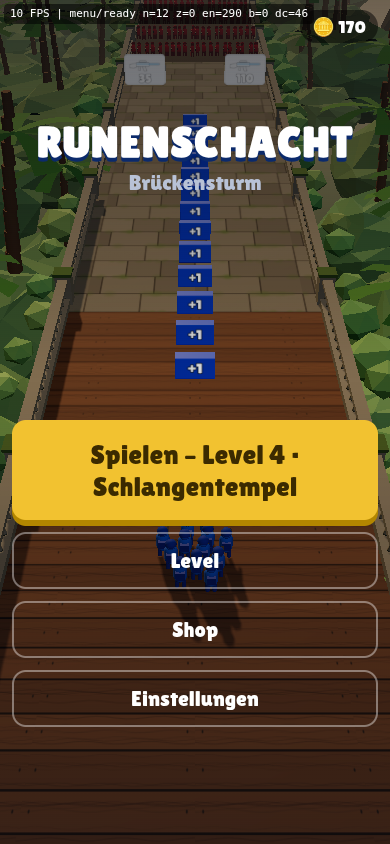 | 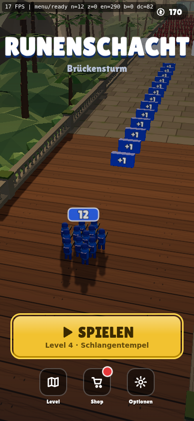 |
| Levelauswahl | 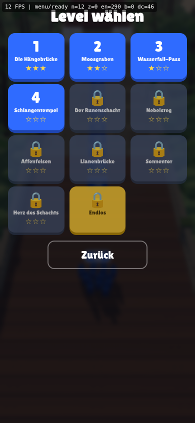 | 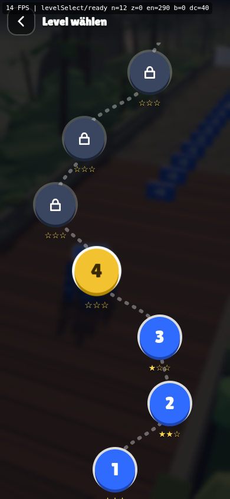 |
| Shop | 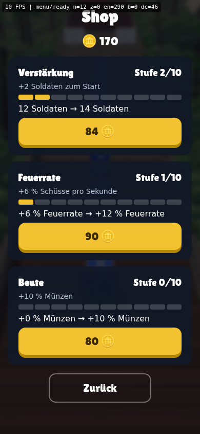 | 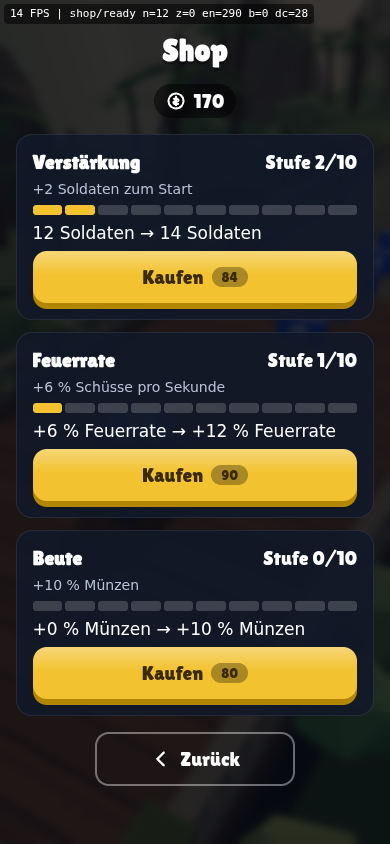 |
| Einstellungen | 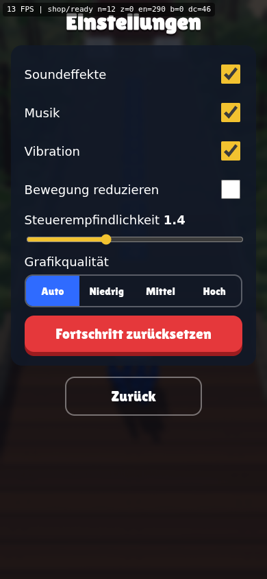 | 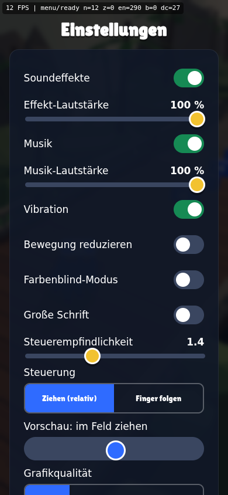 |
| HUD im Lauf | 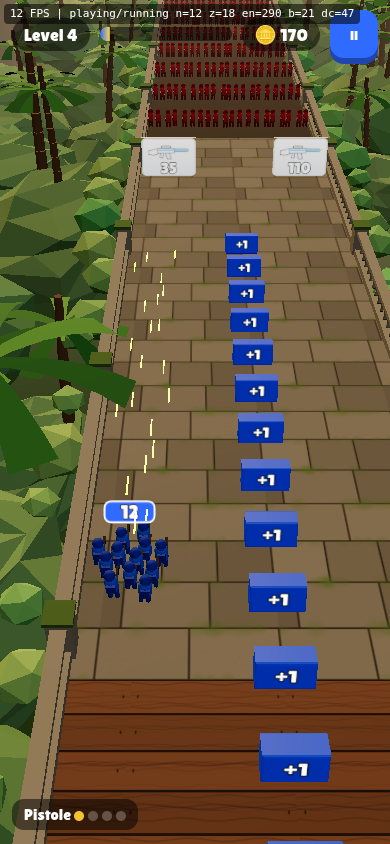 | 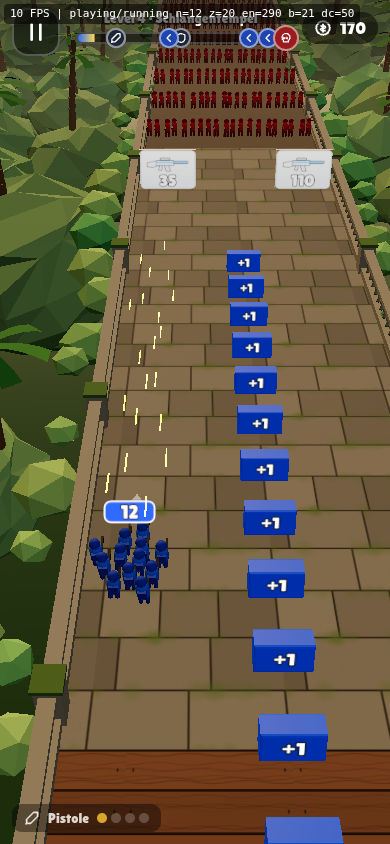 |
| Pause | 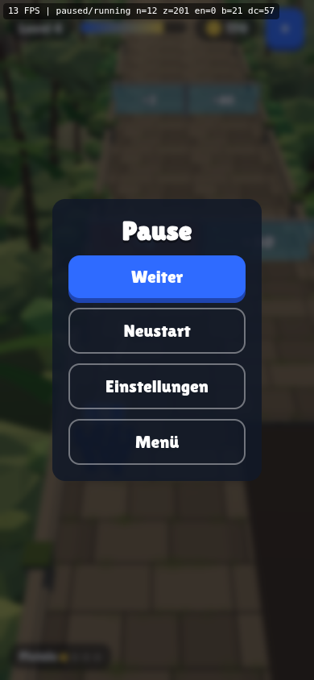 | 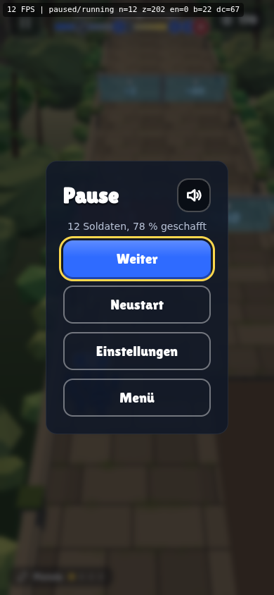 |
| Niederlage | 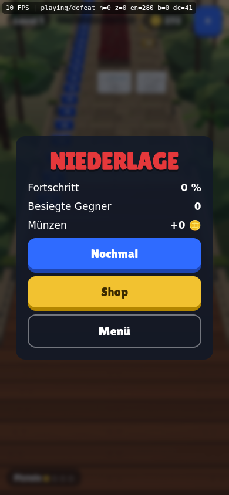 | 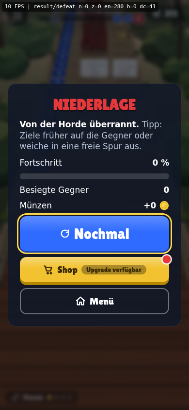 |
| Desktop (HUD bereit) | 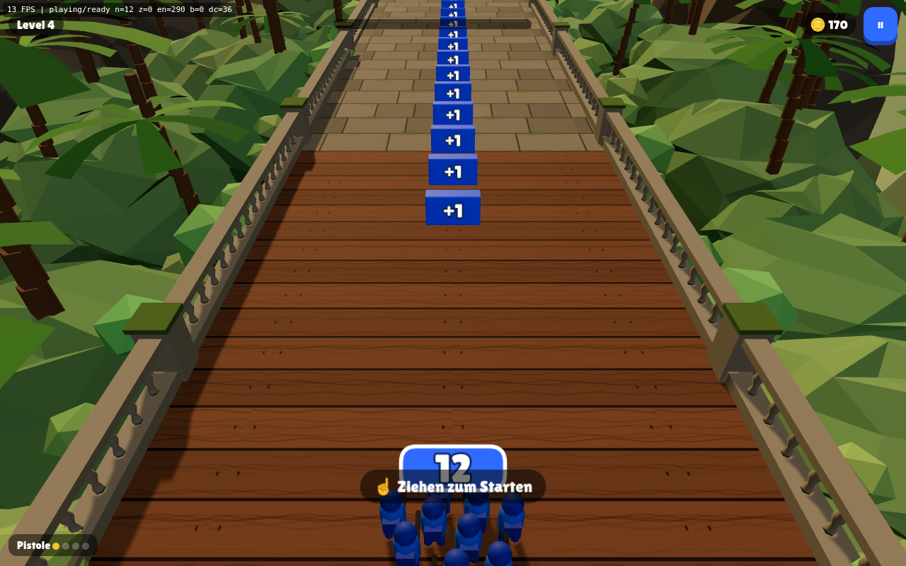 | 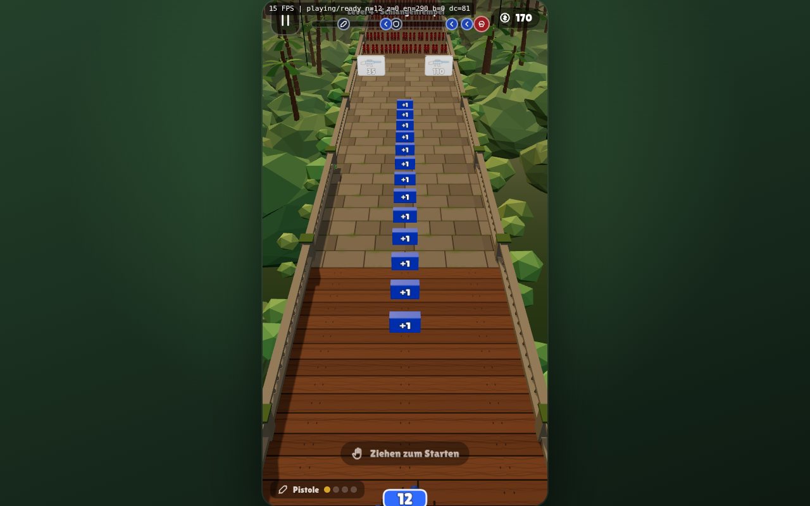 |

Anmerkung zu Zeile 13: Die „dunkle Fläche“ war der Graben unter einer Horde (Level 4), kein Schatten-Artefakt.
Er wurde aufgehellt und liegt jetzt nicht mehr fast schwarz auf der Brücke.

Nicht auf echter Hardware geprüft: Drehen-Hinweis (Zeile 22), Wake Lock, Vibration, iOS-Ton-Hinweis (Zeile 23).

## Kontrastprüfung (`node scripts/contrast-check.mjs`)

| Paar | Verhältnis | Mindestwert |
|---|---|---|
| Weiß auf Blau (Button) | 4.50 : 1 | 3 (große Schrift) |
| Weiß auf Blau-700 | 8.28 : 1 | 4.5 |
| Dunkelbraun auf Gold (Button) | 8.26 : 1 | 4.5 |
| Weiß auf Rot (Button) | 4.23 : 1 | 3 (große Schrift) |
| Weiß auf Panel | 15.15 : 1 | 4.5 |
| Gedämpft auf Panel | 8.46 : 1 | 4.5 |
| Gold auf Panel | 9.04 : 1 | 4.5 |
| Tinte auf Papier (Tipp-Blase) | 16.77 : 1 | 4.5 |
| Weiß auf Grün-700 (Schalter an) | ≥ 3 : 1 | 3 |

Der Schalter war zunächst mit Grün-500 nur 2.3 : 1 und wurde auf Grün-700 abgedunkelt.

